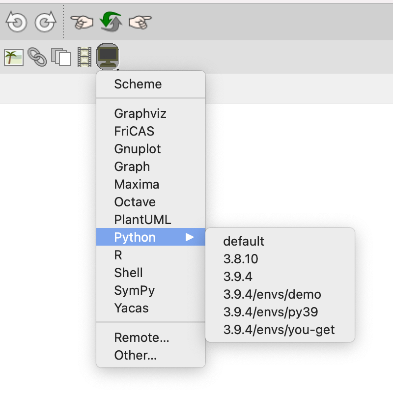

# Enhanced Python Plugin with pyenv Support for GNU TeXmacs
## Installation
```
# For GNU/Linux or macOS
git clone https://gitee.com/XmacsLabs/pyenv.git $HOME/.TeXmacs/plugins/pyenv

# For Windows
git clone https://gitee.com/XmacsLabs/pyenv.git %APPDATA%\TeXmacs\plugins\pyenv
```

Installed under `TEXMACS_HOME_PATH`, this enhanced python plugin will
override the system default one.

## Screenshots

